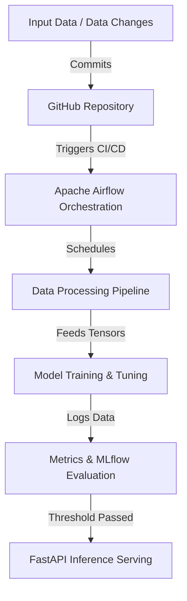

# End-to-End Automated Image Classification Pipeline

An automated Machine Learning Operations (MLOps) pipeline designed to continuously combat data drift. Instead of relying on massive static models, this architecture rapidly processes incoming custom data (based on the **Caltech-101** dataset), trains lightweight Convolutional Neural Networks (**ResNet18**, **MobileNetV3-Small**), evaluates them using **F1 Macro scoring** to handle class imbalance, and deploys the superior model to a containerized **FastAPI** endpoint.

## 👥 Team 16 Members
* **Pruthwiraj Lenka** (Roll No: da25m607) – Data Preprocessing (Beam/Spark), CI/CD, Docker, Cloud Ops
* **Amol Goel** (Roll No: da25m544) – Data Preprocessing (Beam/Spark), CI/CD, Docker, Cloud Ops
* **Varun A V** (Roll No: da25m633) – Model Training, Ray Integration, mlflow
* **Naidu Vamsi Krishna** (Roll No: da25m593) – Airflow Orchestration, System Testing, Quality Assurance

---

## 🏗️ System Architecture



### Component Breakdown
* **Orchestration:** Apache Airflow manages strict Directed Acyclic Graphs (DAGs) to ensure data preprocessing completes before GPU provisioning.
* **Compute Layer:** GCP CPU instances are used for data cleaning/resizing (to prevent GPU idle time), and lightweight 12 GB VRAM GCP GPUs are used for model training.
* **Tracking:** MLflow tracks training metrics and model weights.
* **Deployment & CI/CD:** GitHub Actions automates container builds and pushes to GCP Artifact Registry. FastAPI serves the final model.

---

## 📂 Folder Structure

```text
.
├── .dvc/                     # Data Version Control configuration 
├── .github/workflows/        # GitHub Actions CI/CD pipelines (deploy.yml) 
├── preprocessing/            # Data engineering logic 
│   ├── Dockerfile            # CPU-optimized container for data prep 
│   ├── augment.py 
│   └── requirements.txt 
├── training/                 # Model development and training logic 
│   ├── src/ 
│   │   ├── models/           # ResNet18 and MobileNetV3 architectures 
│   │   ├── helpers/          # Ray integration and data loaders 
│   │   └── training_config.yaml # Hyperparameters and system config 
├── data.dvc                  # Dataset tracking pointer 
├── docker-compose.yaml       # Local testing environment 
└── requirements.txt          # Root dependencies
```

---

## 🛠️ Setup and Installation Instructions

### 1. Clone the repository
```bash
git clone https://github.com/your-org/DA5402W_project_team16_da25m607.git
cd DA5402W_project_team16_da25m607
```

### 2. Set up the virtual environment
```bash
python3 -m venv venv
source venv/bin/activate
pip install -r requirements.txt
```

### 3. Mount data from GCP
```bash
sudo apt-get install -y gcsfuse
mkdir -p $HOME/data
gcsfuse --implicit-dirs dataset_mtech $HOME/data
```

### 4. Train models

#### a. Train Resnet18
```bash
python3 -m src.models.resnet18.train
```
#### b. Train Mobilenet v3 small
```bash
python3 -m src.models.mobilenet_v3_small.train
```

### 5. Evaluate models

#### a. Evaluate Resnet18 model versions
```bash
python3 -m src.models.resnet18.eval
```
#### b. Train Mobilenet v3 small
```bash
python3 -m src.models.mobilenet_v3_small.eval
```

### 6. Deploy best model
```bash
python3 -m src.models.deployment.model_check
```
